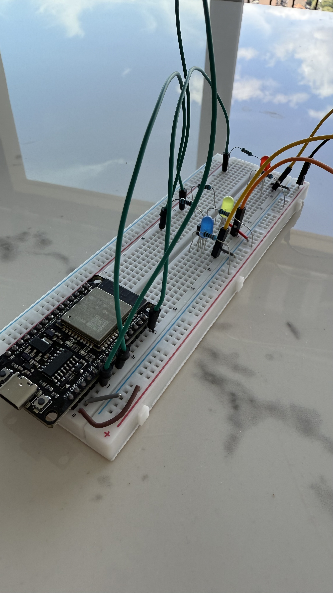
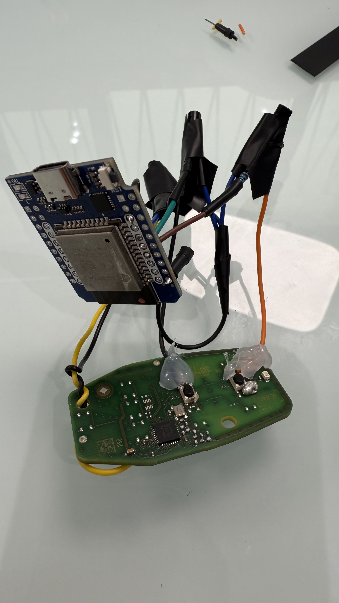

# ESP32 Dynamic iPhone Keyless System v7

🚗 **Smart Proximity-Based Car Access Control using iPhone BLE**

An advanced ESP32-based keyless entry system that automatically detects iPhone presence and controls car door locks. The system dynamically learns iPhone Identity Resolution Keys (IRKs) through BLE pairing and stores them persistently for reliable proximity detection.

## ✨ Features

- 🔑 **Dynamic IRK Learning**: No hardcoded device IDs - learns iPhone IRKs through secure BLE pairing
- 📱 **iPhone Native Integration**: Appears as fitness tracker in iPhone Bluetooth settings
- 💾 **Persistent Storage**: Supports up to 10 devices stored in EEPROM
- 🔒 **Secure Authentication**: Uses iPhone's BLE Identity Resolution Keys for device verification
- 🚗 **Automotive Ready**: Robust proximity detection with hysteresis filtering
- 🔄 **Auto-Recovery**: Smart restart logic prevents BLE stack issues
- 📡 **Advanced BLE Stack**: Handles complex server-to-scanner mode transitions
- 🐕 **Watchdog Protection**: Hardware watchdog prevents system lockups


## 🚀 How It Works

### 1. **Initial Setup Phase**
```
Power On → Check EEPROM → No devices found → 30s Pairing Window
```

### 2. **Device Learning**
- ESP32 advertises as "ESPKV7 Tracker" (fitness device)
- iPhone connects via Bluetooth settings
- System extracts iPhone's IRK during secure pairing
- IRK stored in EEPROM with auto-generated device name
- System restarts for clean BLE initialization
- Now, you can "forget" the device in iOS and remove it (your iOS Device will be identified via the extracted IRK)

### 3. **Operational Mode**
```
Power On → Load devices → 30s pairing window → Auto-restart → Keyless mode
```

### 4. **Proximity Detection**
- Continuous BLE scanning for known iPhone RPA (Resolvable Private Address)
- AES-128 encryption verification using stored IRKs
- Hysteresis filtering prevents false triggers from weak signals
- Automatic unlock when iPhone approaches (RSSI > -80dBm)
- Automatic lock when iPhone leaves (10s timeout + stabilization)

## 🛠️ Hardware Requirements

### Components List
- **ESP32 Development Board** (ESP32-D0WD-V3 recommended)
- **3x NPN Transistors** (2N2222 or BC547)
- **3x 1kΩ Resistors** (for transistor base protection)
- **Car Key Fob** (to be modified)
- **OBD2-to-USB-C Cable** (for permanent power supply)
- **Jumper Wires** and breadboard/perfboard

### Pin Connections
- **Pin 2**: Built-in LED (no external LED needed)
- **Pin 23**: Key power control (through transistor)
- **Pin 19**: Lock signal (through transistor)  
- **Pin 18**: Unlock signal (through transistor)

## 🔌 Wiring Guide

### Key Fob Modification
**⚠️ Warning**: This requires opening and modifying your car key fob. Proceed at your own risk!

1. **Open Key Fob**: Carefully remove the case (usually clips or small screws)
2. **Locate Button Contacts**: Find the lock and unlock button contact points
3. **Identify Power Rails**: Locate VCC (+3V) and GND on the key fob PCB

### ESP32 to Key Fob Wiring

```
ESP32 Pin 23 → 1kΩ Resistor → Transistor Q1 Base
                              Transistor Q1 Collector → Key Fob VCC
                              Transistor Q1 Emitter → GND

ESP32 Pin 19 → 1kΩ Resistor → Transistor Q2 Base  
                              Transistor Q2 Collector → Key Fob Lock Button
                              Transistor Q2 Emitter → Key Fob GND

ESP32 Pin 18 → 1kΩ Resistor → Transistor Q3 Base
                              Transistor Q3 Collector → Key Fob Unlock Button  
                              Transistor Q3 Emitter → Key Fob GND
```

### Detailed Circuit Diagram

```
Key Fob Power Control (Pin 23):
ESP32 Pin 23 ──[1kΩ]──┬── Base (B)
                       │
                    ┌──┴──┐
                    │ Q1  │ 2N2222
Key Fob VCC ────────┤  C  │
                    │  E  │
Key Fob GND ────────┴─────┘


Lock Button Control (Pin 19):
ESP32 Pin 19 ──[1kΩ]──┬── Base (B)
                       │
                    ┌──┴──┐
                    │ Q2  │ 2N2222
Lock Button ────────┤  C  │
                    │  E  │  
Key Fob GND ────────┴─────┘


Unlock Button Control (Pin 18):
ESP32 Pin 18 ──[1kΩ]──┬── Base (B)
                       │
                    ┌──┴──┐
                    │ Q3  │ 2N2222
Unlock Button ──────┤  C  │
                    │  E  │
Key Fob GND ────────┴─────┘
```

### Connection Steps

1. **Prepare Transistors**: Connect 1kΩ resistor to each transistor base
2. **Power Control**: Connect Q1 collector to key fob VCC, emitter to GND
3. **Lock Control**: Connect Q2 collector to lock button, emitter to key fob GND  
4. **Unlock Control**: Connect Q3 collector to unlock button, emitter to key fob GND
5. **ESP32 Connections**: Connect resistor ends to ESP32 pins 23, 19, 18
6. **Test**: Use multimeter to verify connections before powering on

### 🔋 Power Supply via OBD2

For permanent installation in your car, power the ESP32 through the OBD2 port:

#### **Why OBD2 Power?**
- ✅ **Always Available**: OBD2 provides constant 12V power (even when car is off)
- ✅ **Easy Installation**: No need to tap into car wiring
- ✅ **Removable**: Can be unplugged if needed
- ✅ **Standard Location**: OBD2 port is accessible in all modern cars

#### **Required Cable**
You need an **OBD2-to-USB-C cable** that provides 5V output for ESP32:

🛒 **[Find OBD2-to-USB-C cables on Google Shopping](https://www.google.com/search?tbm=shop&q=obd2+to+usb+c+cable)**

#### **Connection Setup**
```
Car OBD2 Port → OBD2-to-USB-C Cable → ESP32 USB-C Port
```

#### **Important Notes**
- **Voltage**: Ensure cable outputs 5V (not 12V) to avoid damaging ESP32
- **Current**: Cable should support at least 500mA for ESP32 operation
- **Continuous Power**: Most OBD2 ports provide power even when car is off
- **Location**: Mount ESP32 near OBD2 port (usually under dashboard)


#### **Proof of Concept on Breadboard (LEDs only for visual confirmation):**



#### **Prototype:**



## 📋 Installation

### 🚀 Quick Flash (Web Browser)
**Easiest method - no software installation required:**

1. **Download firmware**: [ESP32_Keyless_v7_Complete.bin](ESP32_Keyless_v7_Complete.bin)
2. **Open Web Flasher**: [ESP Tool Online](https://esptool.spacehuhn.com/)
3. **Connect ESP32** via USB cable
4. **Click "Connect"** and select your ESP32's COM port
5. **Add firmware file** and **IMPORTANT: set offset to `0x0` (zero!)**
6. **Flash** the firmware  
7. **Done!** ESP32 is ready to use

**🚨 Critical**: Always use offset `0x0` (not 0x10000)! This complete image includes bootloader, partitions, and application.

### 🛠️ Development Setup
For code modifications and development:

#### Prerequisites
- [PlatformIO](https://platformio.org/) installed
- ESP32 development environment configured

#### Setup
```bash
git clone https://github.com/crazyhoesl/ESPKeylessCar
cd ESPKeylessCar
pio run --target upload
pio device monitor
```

### Library Dependencies
```ini
lib_deps = 
    h2zero/NimBLE-Arduino@^1.4.0
    ESP32 BLE Arduino
    EEPROM
```

## 🔧 Configuration

### Device Limits
```cpp
#define MAX_DEVICES 10           // Maximum stored devices
#define PAIRING_TIMEOUT_MS 30000 // 30-second pairing window
```

### Proximity Settings
```cpp
const int RSSI_THRESHOLD = -80;          // ~15-20m detection range
const unsigned long PROXIMITY_TIMEOUT = 10000; // 10s timeout
const int WEAK_SIGNAL_THRESHOLD = 3;    // Hysteresis filtering
```

### Hardware Pins
```cpp
const int LED_PIN = 2;           // Built-in ESP32 LED
const int KEY_POWER_PIN = 23;    // Key fob power control (via transistor)
const int LOCK_BUTTON_PIN = 19;  // Lock signal (via transistor)
const int UNLOCK_BUTTON_PIN = 18; // Unlock signal (via transistor)
```

## 📱 iPhone Setup

1. **Power on ESP32** - wait for "ESPKV7 Tracker" to appear
2. **Open iPhone Settings** → Bluetooth
3. **Connect to "ESPKV7 Tracker"** (appears as fitness device)
4. **Enter PIN: 123456** when prompted
5. **Wait for automatic restart** - system switches to keyless mode
6. **Done!** Your iPhone is now learned and will be detected automatically

## 🔄 System States

### LED Status Indicators
- **Slow blink (1s)**: Pairing mode - waiting for connection
- **Fast blink (200ms)**: Device connected - pairing in progress  
- **3x short blinks**: Device successfully added
- **2x long blinks**: Maximum device limit reached
- **5x very fast blinks**: Pairing error
- **Solid on**: iPhone detected nearby (keyless mode)
- **Off**: No iPhones detected

### Serial Debug Output
```
🔵 ESP32 Dynamic Keyless System v7
🔍 Reset reason: 1
✅ Found 2 known devices
📱 Go to iPhone Settings > Bluetooth and look for 'ESPKV7 Tracker'
🔑 IRK successfully extracted and saved!
📱 Device_01 detected (RSSI: -41)
🔓 Welcome! Activating unlock sequence...
```

## 🧠 Technical Deep Dive

### BLE Identity Resolution
The system uses iPhone's BLE privacy features for secure device identification:

1. **RPA Verification**: Validates Resolvable Private Addresses
2. **IRK Cryptography**: AES-128 encryption with stored Identity Resolution Keys
3. **Byte-Order Handling**: Corrects ESP32 BLE stack byte reversal
4. **Address Rotation**: Works with iPhone's automatic address randomization

### Code Architecture
```cpp
// Core Components
- Dynamic IRK extraction and storage
- Dual-mode BLE (Server for pairing, Scanner for detection)
- Automotive-grade proximity algorithms
- Reset-reason based state management
- Hardware watchdog integration
```

### Advanced Features
- **Hysteresis Filtering**: Prevents false triggers from signal fluctuations
- **Multi-device Support**: Handles multiple iPhones simultaneously  
- **Graceful Degradation**: Continues operation if one device fails
- **Memory Management**: Efficient EEPROM usage with wear leveling
- **Power Management**: Optimized for automotive 12V systems

## 🔒 Security Considerations

- ✅ **IRK-based Authentication**: Uses Apple's BLE security framework
- ✅ **Fixed PIN**: Prevents unauthorized device addition (PIN: 123456)
- ✅ **Physical Access Required**: Device pairing requires physical presence
- ✅ **No Cloud Dependencies**: Fully offline operation
- ⚠️ **Production Hardening**: Consider additional security for personal or commercial use

## 🐛 Troubleshooting

### Common Issues

**"BLE scan parameter error 259"**
- Fixed by auto-restart mechanism
- Caused by ESP32 BLE stack mode transitions

**"iPhone not detected"**  
- Check RSSI threshold (-80dBm default)
- Verify IRK extraction during pairing
- Ensure iPhone Bluetooth is enabled

**"Pairing fails"**
- Use exactly PIN: 123456
- Restart ESP32 if pairing window expired
- Check for BLE interference

**"Endless restart loop"**
- Fixed by reset-reason detection
- Power cycle ESP32 to reset state

## 📈 Performance Metrics

- **Detection Range**: ~2-5 meters (adjustable via RSSI threshold)
- **Response Time**: <3 seconds from approach to unlock
- **Power Consumption**: ~80mA during scanning, ~120mA during pairing
- **Memory Usage**: 87% Flash, 12% RAM (ESP32-D0WD-V3)
- **Supported Devices**: Up to 10 iPhones simultaneously

## 🤝 Contributing

Contributions welcome! Please read our contributing guidelines and submit pull requests for:
- Additional smartphone support (Android BLE)
- Enhanced security features
- Power optimization
- UI improvements
- Documentation updates

## 📄 License

This project is licensed under the MIT License - see the [LICENSE](LICENSE) file for details.

## 🙏 Acknowledgments

- **Claude AI (Anthropic)** - Essential development assistance, code architecture, and comprehensive documentation
- ESP32 BLE Arduino library contributors
- Apple's BLE privacy specification
- Automotive security best practices
- Open source community feedback
- Special thanks to: **Christian** for the discussions during the build, which helped a lot! The podcast **[bitsundso.de #958](https://www.bitsundso.de/bus958/)** for the idea to achieve this with Claude Code. Also a big thanks for the inspiration from the YouTube channel community of **[Spiel und Zeug](https://www.youtube.com/@spielundzeug)**! And finally to my beautiful and smart **partner** ❤️, for supporting me during the hours I've spent and especially for your tears of joy when I had the breakthrough after weeks of failure during the IRK calculations. 

---

**⚠️ Disclaimer**: This system is intended for educational and personal use. Ensure compliance with local automotive regulations and security requirements for commercial applications.
